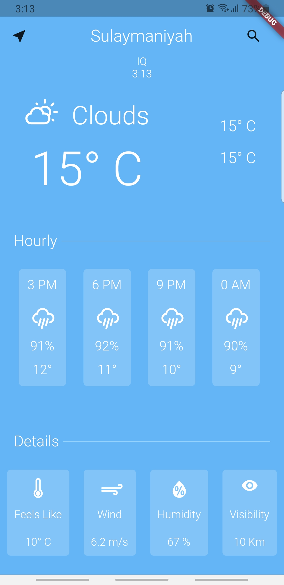
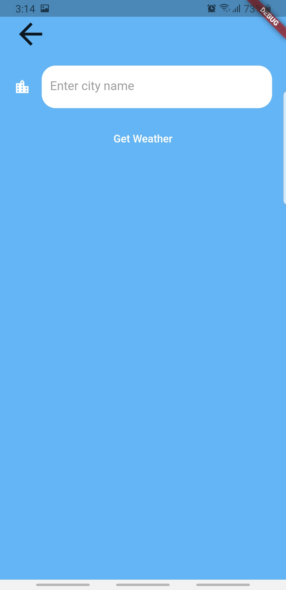

# weather

A new Flutter project.

this app talks to an API from openweathermap.com and brings weather data of your location and any location you search for.
<<<<<<< HEAD

=======
>>>>>>> 5d8154943bb013d1f751ec2e2167a9238cad0677
